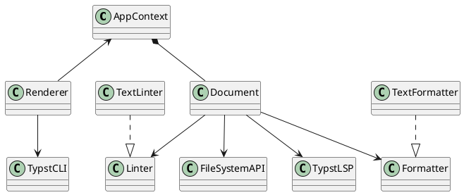

# Диаграмма классов

```plantuml
@startuml
AppContext <-- Renderer
AppContext *-- Document

Renderer --> TypstCLI

Document --> FileSystemAPI
Document --> Linter
Document --> Formatter
Document --> TypstLSP

TextLinter ..|> Linter
TextFormatter ..|> Formatter


@enduml
```
