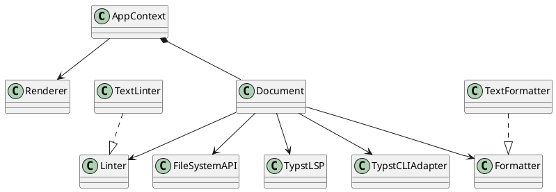

# Диаграмма классов

```plantuml
@startuml
AppContext --> Renderer
AppContext *-- Document

Document --> FileSystemAPI
Document --> Linter
Document --> Formatter
Document --> TypstLSP
Document --> TypstCLIAdapter


TextLinter ..|> Linter
TextFormatter ..|> Formatter
@enduml
```

